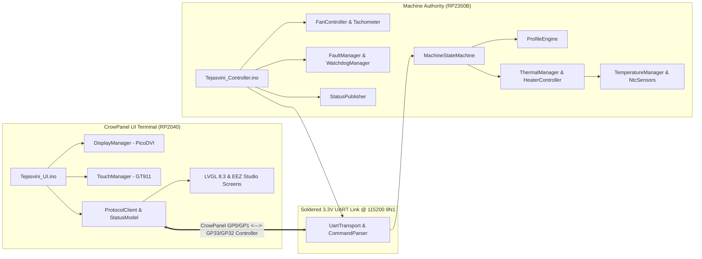

# Tejasvini Firmware Architecture

> [!NOTE]
> This document has been superseded by the definitive dual-target architecture guide:
> **[docs/firmware-architecture.md](firmware-architecture.md)**

---

## Architecture Summary

Tejasvini employs a decoupled, dual-target architecture designed for reliability, responsiveness, and safe machine execution:

### Targets & Components
1. **Tejasvini UI Firmware (`firmware/Tejasvini_UI/`)**:
   - Platform: Elecrow CrowPanel 4.3" Pico DVI Display (RP2040).
   - Role: Pure HMI terminal; displays telemetry and transmits user commands. Zero safety authority.
2. **Tejasvini Controller Firmware (`firmware/Tejasvini_Controller/`)**:
   - Platform: Custom RP2350B Machine Controller Board.
   - Role: Sole machine authority; owns NTC sampling, PI loop regulation, SSR actuation (clamped to 40% duty), fans, buzzer, ARGB, and safety interlocks.
3. **Shared Protocol & Types (`firmware/shared/`)**:
   - Single shared library defining packet formats, machine states, error codes, and serialization utilities.

### Detailed Technical Specifications
* **[Firmware Architecture](firmware-architecture.md)**: Subsystem breakdowns, execution models, and data flows.
* **[UART Wire Protocol](uart-protocol.md)**: Frame grammar, command/response dictionary, and timing matrix.
* **[Safety Behavior & Interlocks](safety-behavior.md)**: Multi-layer failsafes, bounds checks, and timeout recovery.
* **[Hardware Pin Mapping](hardware-pin-map.md)**: Full GPIO allocation tables for both boards.
* **[EEZ Studio UI Workflow](eez-studio-workflow.md)**: UI design, editing, and code generation workflow.
* **[Firmware Build & Upload Guide](build-instructions.md)**: Toolchains, board packages, and test commands.
