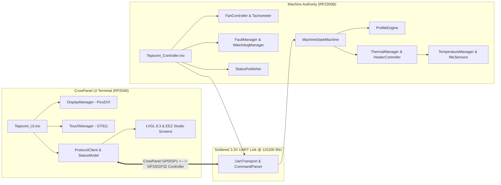

# Tejasvini Firmware Architecture

This document provides the definitive architectural specification for the refactored **Tejasvini** dual-target firmware system.

---

## 1. Architectural Philosophy: Two Targets, One Shared Core

Tejasvini separates user-interface presentation from physical machine control across two distinct microcontroller platforms communicating over a dedicated physical UART link:

1. **Tejasvini UI Firmware (`firmware/Tejasvini_UI/`)**:
   - **Hardware**: Elecrow CrowPanel 4.3" Pico DVI Display (Raspberry Pi Pico RP2040).
   - **Role**: Pure Human-Machine Interface (HMI) terminal.
   - **Characteristics**: Manages PicoDVI rendering, capacitive touch interaction, visual transitions, menu navigation, and settings. It is completely isolated from hardware actuation, thermal calculations, and safety decisions.
2. **Tejasvini Controller Firmware (`firmware/Tejasvini_Controller/`)**:
   - **Hardware**: Custom RP2350B Machine Controller Board.
   - **Role**: Absolute machine authority and safety supervisor.
   - **Characteristics**: Owns sensor acquisition, calibration, filtering, SSR time-proportioning, PI loop regulation, reflow profile execution, fan PWM, fan tachometer capture, buzzer alarms, ARGB indicators, and watchdog recovery.
3. **Shared Specification & Protocol Library (`firmware/shared/`)**:
   - **Role**: Single source of truth for communication structures, enums, fault definitions, and serialization utilities. Shared identically across both targets to eliminate duplicate code.

---

## 2. Separation of Responsibilities

| Responsibility | CrowPanel UI (`Tejasvini_UI`) | Machine Controller (`Tejasvini_Controller`) |
| :--- | :---: | :---: |
| **Display Initialization & DVI Flush** | **YES** | NO |
| **Capacitive Touch Decoding (GT911)** | **YES** | NO |
| **Screen Layout & Theme Styling** | **YES** | NO |
| **Menu & Profile Selection Display** | **YES** | NO |
| **High-Level Command Dispatch** | **YES** | NO |
| **Telemetry & Status Presentation** | **YES** | NO |
| **NTC ADC Sampling & Oversampling** | NO | **YES** |
| **Steinhart-Hart / Beta Math** | NO | **YES** |
| **Sensor Fault & Divergence Detection**| NO | **YES** |
| **Closed-Loop PI Regulation** | NO | **YES** |
| **SSR Zero-Cross Time Proportioning** | NO | **YES** |
| **40% Duty Cycle Clamping (`MAX_DUTY`)**| NO | **YES** |
| **Emergency Over-Temperature Shutoff** | NO | **YES** |
| **Reflow Stage Scheduling & Timing** | NO | **YES** |
| **Fan PWM & Tachometer Feedback** | NO | **YES** |
| **Audible Buzzer & ARGB Lighting** | NO | **YES** |
| **Rotary Encoder Physical Inputs** | NO | **YES** |
| **Hardware Watchdog Supervisor** | NO | **YES** |

---

## 3. Why the Controller is the Source of Truth

In high-power thermal machines (such as a 400W mains-powered PTC heatplate), safety cannot depend on an operating system, a graphics rendering loop, or an external display panel:

1. **Decoupled Graphics Latency**: Heavy LVGL animations or frame flushing do not delay the 100ms PI control loop or the sub-millisecond SSR switching.
2. **Crash Resilience**: If the CrowPanel screen locks up, browns out, is damaged, or disconnects, the machine controller immediately detects UART inactivity via its communication watchdog. If heating, it forces the heater **OFF** and latches a critical fault.
3. **No Safety Decisions on the UI**: The UI never decides whether it is safe to turn on a heater or what duty cycle to apply. It sends an intent (`START_PROFILE` or `SET_TARGET`), and the controller validates all physical bounds before engaging power.

---

## 4. Module Boundaries & Data Flow

### 4.1 UI Firmware Pipeline
* **`TouchManager`**: Reads GT911 over I2C (SDA GP20, SCL GP21) and translates coordinates to 240x400 portrait space.
* **`DisplayManager`**: Manages PicoDVI double-buffered RGB565 scanout and dispatches 8-line partial buffer flushes.
* **`ProtocolClient`**: Transmits commands (`CMD <seq> <NAME>`) and parses incoming `STATUS` lines without blocking.
* **`StatusModel`**: Maintains the latest state received from the controller and formats strings/values consumed by EEZ Studio variable getters (`vars.h`).
* **`UiBridge`**: Intercepts user UI events (`actions.c`) and maps them to protocol commands (`ProtocolClient`).

### 4.2 Controller Firmware Pipeline
* **`UartTransport`**: Non-blocking line receiver on GP32 (TX) / GP33 (RX) and USB CDC.
* **`CommandParser`**: Validates commands, arguments, and parameter ranges.
* **`MachineStateMachine`**: Enforces legal state progression (`IDLE` $\to$ `HEATING` $\to$ `SOAKING` $\to$ `REFLOWING` $\to$ `COOLING` $\to$ `COMPLETE` $\to$ `IDLE`). Rejects illegal state requests.
* **`TemperatureManager`**: Reads dual (or triple) NTC thermistors via 32x trimmed oversampling, validates electrical bounds ($50 \le \text{ADC} \le 4050$), checks divergence ($\le 15^\circ\text{C}$ pre-heat, $\le 35^\circ\text{C}$ heating), and trips overtemperature at $280^\circ\text{C}$.
* **`ThermalManager`**: Generates soft-start ramp profiles and runs the PI controller with anti-windup clamping.
* **`HeaterController`**: Controls `PIN_SSR` via 1000ms zero-cross time-proportioning, with hardware-enforced 40% duty ceiling.
* **`FanController` & `Tachometer`**: Regulates cooling airflow and measures RPM feedback.
* **`EncoderManager`, `BuzzerManager`, `ArgbManager`**: Manages local board controls and human audiovisual cues.
* **`StatusPublisher`**: Broadcasts `STATUS` packets over UART at 2 Hz and sends immediate `ACK`/`NACK`/`FAULT` responses.

---

## 5. Failure & Fault Behavior Matrix

| Failure Mode | Detection Subsystem | Controller Action | UI Presentation |
| :--- | :--- | :--- | :--- |
| **CrowPanel Disconnects / Freezes** | `ControllerApp` comm watchdog | If heating: kills heater, trips `FAULT_COMM_TIMEOUT`. If cooling: maintains fan cooling. | UI shows `DISCONNECTED` |
| **Sensor Disconnected (Open)** | `TemperatureManager` ($ADC < 50$) | Kills heater immediately ($<100$ms), trips `FAULT_NTC1_OPEN`. | Status `ERROR`, NTC status `ERROR` (Red) |
| **Sensor Short to 3.3V** | `TemperatureManager` ($ADC > 4050$) | Kills heater immediately ($<100$ms), trips `FAULT_NTC1_SHORT`. | Status `ERROR`, NTC status `ERROR` (Red) |
| **Thermal Runaway** | `ThermalManager` ($<2^\circ\text{C}$ rise / 18s @ $\ge 20\%$) | Kills heater immediately, trips `FAULT_THERMAL_RUNAWAY`. | Status `ERROR`, buzzer alarm siren |
| **Emergency Over-Temp** | `TemperatureManager` ($T \ge 280^\circ\text{C}$) | Kills heater immediately, trips `FAULT_OVERTEMP`. | Status `ERROR`, buzzer alarm siren |
| **Controller Firmware Lockup** | Hardware Watchdog (8000ms) | Microcontroller hardware reset, boots with all outputs OFF. | UI shows `DISCONNECTED` then reconnects |
