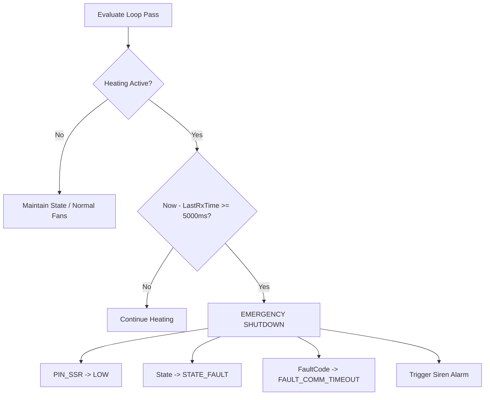

# Tejasvini Safety Behavior & Interlock Specification

This document details the deterministic, fail-safe rules governing the machine control firmware.

---

## 1. Golden Rules of Safety Authority

1. **The Controller is the Machine Authority**: The CrowPanel UI has zero authority over machine safety. The UI is strictly an input terminal and visual dashboard.
2. **Safe Default State**: All power outputs, relays, heaters, and actuators must start in an inert, non-powered state.
3. **Latching Critical Shutdown**: Any sensor anomaly, thermal runaway, or communication loss immediately trips a latching shutdown (`STATE_FAULT`). The heater remains locked out until the sensor returns to physical bounds and the user issues an explicit `CLEAR_FAULT` command.
4. **Hardware Duty Limit**: The software strictly clamps solid-state relay duty cycle to **40% (`MAX_DUTY_CYCLE`)** to prevent thermal stress on the 400W PTC heater and the SSR.

---

## 2. Startup Outputs Safe State

When the RP2350B machine controller powers on or resets, outputs are initialized immediately before entering the main loop:

| Output / Peripheral | Safe Startup State | Physical Pin Action |
| :--- | :--- | :--- |
| **Heater (SSR)** | **OFF (Inert)** | `pinMode(PIN_SSR, OUTPUT); digitalWrite(PIN_SSR, LOW);` |
| **Auxiliary Safety Relay** | **OFF (De-energized)** | `pinMode(PIN_RELAY, OUTPUT); digitalWrite(PIN_RELAY, LOW);` |
| **Cooling Fan 1** | **Safe Idle / 0%** | `writePwm(PIN_FAN1_PWM, 0);` |
| **Cooling Fan 2** | **Safe Idle / 0%** | `writePwm(PIN_FAN2_PWM, 0);` |
| **Piezo Buzzer** | **OFF (Silent)** | `digitalWrite(PIN_BUZZER, LOW);` |
| **Status ARGB** | **Cyan Breathe (Booting)** | `setColor(0, 150, 200);` |

---

## 3. Heater-Off & Emergency Stop Semantics

When `emergencyStop()` or `emergencyOff()` is invoked:
1. `duty_pct_` is zeroed (`0.0f`).
2. The PI controller integrator accumulator `integrator_acc_` is zeroed.
3. The hardware GPIO pin (`PIN_SSR`) is immediately written `LOW`.
4. The auxiliary safety relay pin (`PIN_RELAY`) is written `LOW`.
5. Thermal runaway timers and reference temperatures are cleared.

---

## 4. Communication Loss & Timeout Matrix

Communication health is evaluated on every pass of the control loop:

* **Active Heating Timeout**: If heating is active (`STATE_HEATING`, `STATE_SOAKING`, `STATE_REFLOWING`) and no valid packet (heartbeat `PING`, query `GET_STATUS`, or command) is received within **5,000 ms**, power is cut immediately.
* **Cooling Independence**: If communication is lost while the system is in `STATE_COOLING`, cooling fans remain running at 100% until the plate temperature safely drops below 50°C. Communication loss will never abort an active cool-down!

---

## 5. Stop, Pause, and Resume Semantics

### 5.1 STOP
* Command: `CMD <seq> STOP`
* Action:
  - Immediately zeroes duty cycle and drives `PIN_SSR` LOW.
  - Transitions `MachineStateMachine` from `HEATING`, `SOAKING`, `REFLOWING`, or `PAUSED` to `STATE_IDLE`.
  - Resets stage timers and progress counters.
  - Leaves fans in Auto mode (cooling hot surface if above 50°C).

### 5.2 PAUSE
* Command: `CMD <seq> PAUSE`
* Action:
  - Can only be executed while actively in a reflow stage (`HEATING`, `SOAKING`, `REFLOWING`).
  - Stores current sub-stage in `pre_pause_state_`.
  - Transitions to `STATE_PAUSED`.
  - Cuts heater power or drops to low hold power.
  - Freezes stage dwell timer.

### 5.3 RESUME
* Command: `CMD <seq> RESUME`
* Action:
  - Can only be executed while in `STATE_PAUSED`.
  - Compensates for paused duration in stage timer calculations.
  - Restores active state to `pre_pause_state_`.
  - Re-engages PI regulation.

---

## 6. Sensor Failure & Bounds Protection

### 6.1 Fast Raw ADC Bounds Checking ($<100$ms)
Dual 100k NTC thermistors are measured with 32x trimmed mean oversampling:
* **Open Circuit Condition**: If thermistor wire disconnects, the 100k pull-down divider pulls the ADC to GND ($ADC < 50$ counts, $T < -20^\circ\text{C}$).
* **Short Circuit Condition**: If thermistor wire shorts to 3.3V, ADC counts saturate to $4095$ ($ADC > 4050$ counts, $T > 300^\circ\text{C}$).
* **Action**: If either sensor violates bounds, `TemperatureManager` trips `FAULT_NTC1_OPEN`, `FAULT_NTC1_SHORT`, `FAULT_NTC2_OPEN`, or `FAULT_NTC2_SHORT`. Power is killed instantly before passing corrupt numbers to the filter or controller.

### 6.2 Sensor Divergence Guard
* **Pre-Heat Guard**: Before heating begins, NTC1 and NTC2 must agree within **15°C** (`MAX_STARTUP_NTC_DIFF`). This detects a detached thermistor or broken sensor bond while at room temperature.
* **Heating Divergence Guard**: During active heating, if sensor temperatures diverge by more than **35°C** (`MAX_NTC_DIFF`) for 5 consecutive control cycles (500ms debounce), `FAULT_NTC_DIVERGENCE` is latched.

### 6.3 Emergency Over-Temperature (280°C)
If composite temperature, NTC1, or NTC2 ever exceeds **280.0°C** (`OVERTEMP_SHUTDOWN`), the SSR is instantly killed and locked out regardless of machine state.

### 6.4 Thermal Runaway Monitor
When driving $\ge 20\%$ duty cycle with a setpoint deficit $> 10^\circ\text{C}$, the heatbed temperature must increase by at least **2.0°C** within **18 seconds** (`THERMAL_RUNAWAY_PERIOD_MS`). Failure to rise indicates a detached sensor or heater mechanical separation, tripping `FAULT_THERMAL_RUNAWAY`.

---

## 7. Microcontroller Hardware Watchdog

* The RP2350B internal hardware watchdog is initialized to an **8,000 ms** timeout.
* The watchdog is serviced on each iteration of `loop()`.
* If a software lockup or unexpected deadlock occurs, the watchdog resets the MCU.
* Upon reboot, all hardware outputs remain OFF by default.
